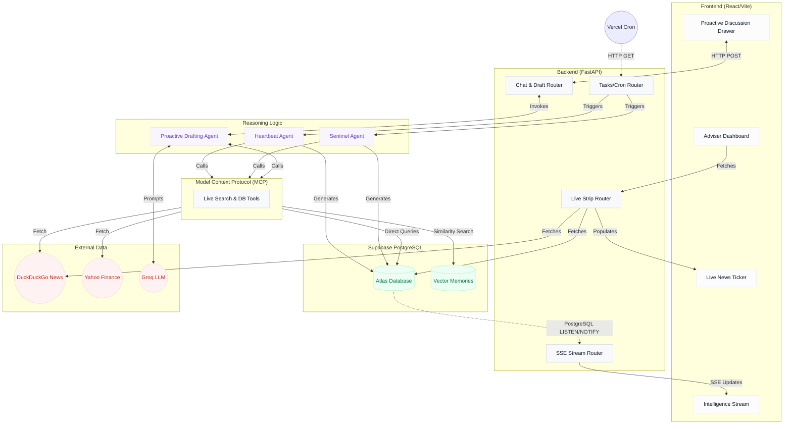
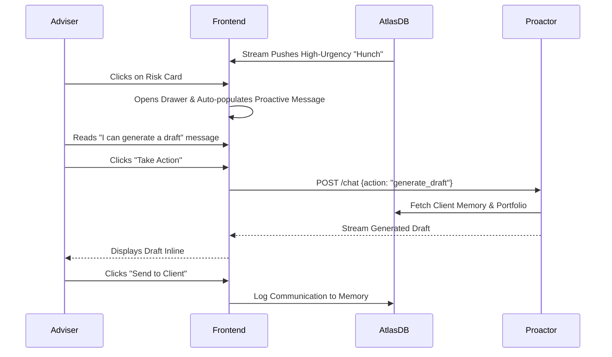

# Atlas AI: System Architecture

Atlas AI is built fundamentally around the concept of a **Proactive Agentic Loop**, transitioning the traditional prompt-response AI model into a continuous, world-aware background worker.

## 1. High-Level Macro Architecture

The architecture is fully decoupled, event-driven, and Serverless-ready.

## 2. The Proactive Discussion Flow

Unlike standard chat, Atlas acts first when the adviser opens a client's risk drawer.

## 3. Serverless Extensibility

By removing internal loops (e.g., `apscheduler`), Atlas's core reasoning functions are pure, parameterized scripts exposed via FastAPI routers (`/tasks/heartbeat`). This allows:
- **Zero-Cost Scaling:** The server scales to zero when no background tasks or advisers are active.
- **Micro-billing:** Vercel only charges for the exact compute seconds it takes Groq to process the Heartbeat.
- **Disaster Recovery:** A failed cron run doesn't crash a persistent process; the next HTTP trigger simply retries cleanly.
