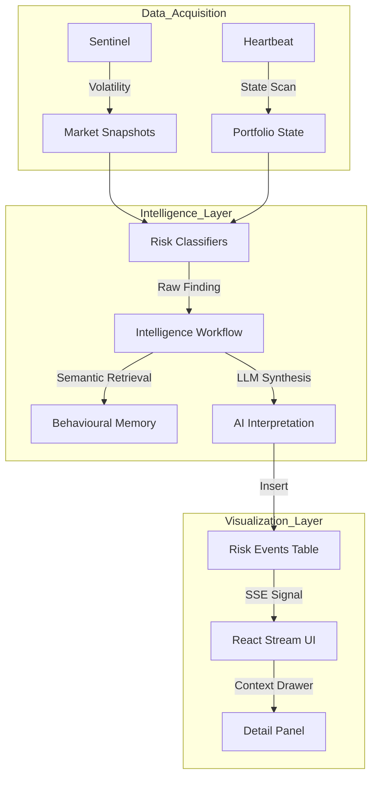

# Architecture Guide - Atlas Zero

## 1. The Proactive Intelligence Loop
Atlas Zero is designed for "Anticipatory Advisory." The architecture is centered around a continuous data loop that converts raw market and portfolio state into actionable advisor intelligence.

### 1.1 Temporal Engines
The system operates on two primary temporal cycles:

1.  **The Sentinel (5m)**:
    - **Trigger**: High-frequency interval.
    - **Action**: Scrapes `yfinance` for FTSE 100/250 and sector performance.
    - **Logic**: If intraday volatility exceeds 2%, it triggers an *Out-of-Band* Heartbeat sweep.

2.  **The Heartbeat (30m)**:
    - **Trigger**: Scheduled interval or Sentinel override.
    - **Action**: Performs a complete book review across all clients.
    - **Logic**: Runs deterministic classifiers to flag risks (Tax, Market, Compliance).

### 1.2 Data Flow: Detection to Visualization

---

## 2. Intelligence Workflow (The Brain)
Unlike traditional agentic systems that can be slow or non-deterministic, Atlas Zero uses a **Linear Intelligence Pipeline**:

1.  **Deterministic Flagging**: A Python-based classifier detects a hard rule violation (e.g., "ISA Allowance < £100").
2.  **Context Assembly**: The system automatically retrieves relevant client memory (via vector search) and the latest market news.
3.  **LLM Interpretation**: A single, high-speed LLM call (Groq/Llama-3) synthesizes the "Strategic Headline" and "Consequence if Ignored."
4.  **Action Dispatch**: The interpreted event is pushed to the UI, accompanied by a drafted email or meeting brief.

---

## 3. Compliance & Auditability
Every piece of intelligence in Atlas Zero is traceable and immutable.

- **Immutable Snapshots**: Each `risk_event` is linked to a `portfolio_snapshot_id` and a `market_snapshot_id`. This allows an advisor to see exactly what the market and client state looked like at the moment the risk was detected.
- **Decision Tracking**: The `action_logs` table records every advisor interaction (Approve, Reject, Dismiss) with an associated timestamp and user ID, providing a robust compliance trail.
- **Deterministic Reasoning**: By separating *detection* (Python) from *interpretation* (AI), we ensure that core risk logic is 100% reliable and auditable.
