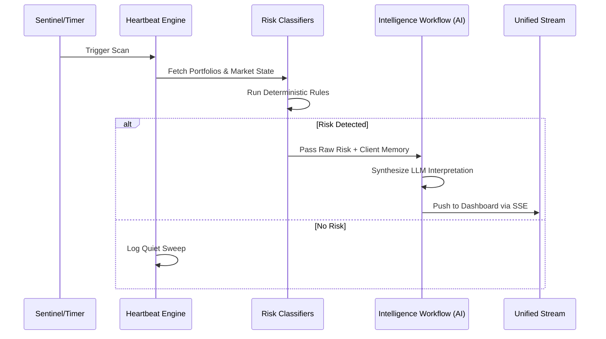

# Product Requirements Document (PRD) - Atlas Zero

## 1. Vision & Strategy
**Atlas Zero** is a proactive, compliance-aware intelligence layer for UK financial advisers. Instead of waiting for adviser prompts, Atlas continuously monitors market data, client portfolios, and tax timelines to detect material changes and surface relevant consequences.

### 1.1 Core Value Proposition
- **Deterministic Risk Detection**: Eliminates human error in monitoring thresholds (FTSE drops, sector exposure, mandate drift).
- **Cognitive Augmentation**: Provides context-aware meeting briefs, geopolitical risk interpretations, and drafted responses using LLMs.
- **UK-Specific Logic**: Tailored for UK tax years (ISAs, Pension Allowances, CGT), market indices (FTSE 100/250), and UK sector performance.
- **Compliance First**: Immutable audit trails for every decision made by the adviser, ensuring a permanent "Reason for Advice" record.

---

## 2. Product Principles
1. **Adviser-in-the-Loop**: Atlas detects and suggests; the advisor validates and executes. Automation serves human decision-making.
2. **Deterministic over Probabilistic**: Core risk detection never uses LLMs; only the *interpretation* of that risk is handled by AI.
3. **High Signal, Low Noise**: Focused alerts are combined into a unified intelligence stream, preventing notification fatigue.
4. **Contextual Awareness**: Every alert is enriched with client-specific behavioural memory (e.g., "Client is risk-averse regarding energy stocks").

---

## 3. High-Level Workflows

### 3.1 The Proactive Intelligence Cycle

### 3.2 Pre-Meeting Briefing
- **Trigger**: Calendar integration or manual advisor request.
- **Logic**: Aggregates all open risks, recent tax windows, and behavioural memories for a specific client.
- **Output**: A structured "Strategic Brief" including suggested talking points and prioritized actions.

---

## 4. Feature Requirements

### 4.1 Intelligence Engine (Backend)
- **Sentinel (5m)**: Real-time monitoring of FTSE 100/250 and key UK sectors (Financials, Energy, Consumer).
- **Heartbeat (30m)**: Complete book sweep for ISA remaining allowances, CGT exposure, Pension tapering, and Mandate drift.
- **Vulnerability Assessor**: FCA-aligned scoring (0.0 - 1.0) based on life events (bereavement, health, redundancy) detected in client memory.

### 4.2 Agentic UI (Frontend)
- **Unified Intelligence Stream**: A real-time feed of market interrupts, tax opportunities, and meeting briefs.
- **Live Market Strip**: A scrolling indicator of market health and book-wide impact metrics.
- **Action-Ready Cards**: Instant "Approve & Send" or "Edit Draft" actions embedded directly in the intelligence stream.

### 4.3 Compliance & Audit
- **Immutable Snapshots**: Capture active portfolio and market state at the exact moment a risk is detected.
- **Action Logging**: Log every advisor interaction (approval, dismissal, edit) for regulatory proof of supervision.

---

## 5. Non-Goals
- **Autonomous Execution**: The system will NEVER trade or send emails without explicit advisor approval.
- **Client-Facing UI**: Atlas Zero is an internal tool for professional advisors only.
- **Full CRM Replacement**: Focused on intelligence and action, not general document storage or lead management.
