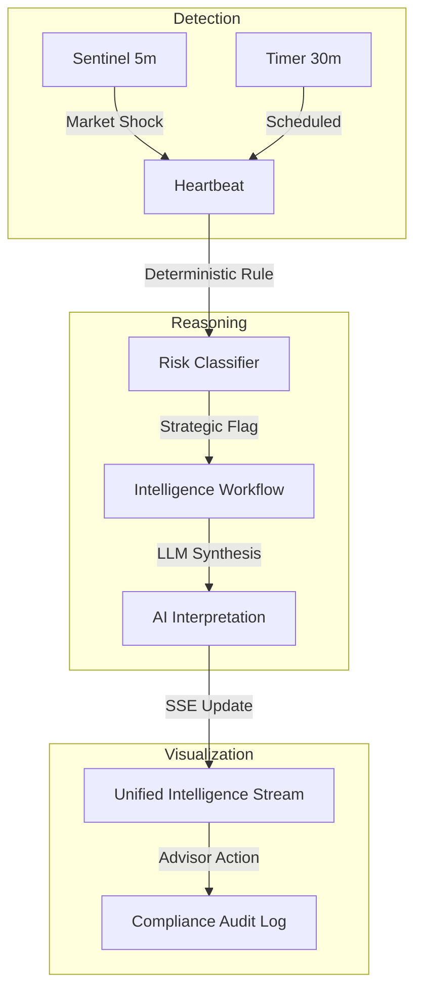

# Atlas Zero 📘

> **The Cognitive Augmentation Layer for UK Financial Advisors.**

**Atlas Zero** is not a dashboard. It is a proactive UK Advisory Intelligence Layer designed for high-performance financial advisors. It continuously monitors client portfolios, UK market movements, and tax considerations to surface actionable insights before they are requested.

---

## 🏛 The Vision: Proactive by Design
Modern advisory is reactive. Atlas Zero flips the script. By integrating real-time market data with deep client behavioural memory, Atlas detects risks and opportunities in the background, allowing advisors to focus on high-value human interactions.

- **Live Market Sentinel**: 5-minute volatility monitoring for the FTSE 100/250 and UK sectors using real-time data.
- **Proactive Heartbeat**: 30-minute full-book scans detecting portfolio drift, tax windows, and behavioural triggers.
- **Contextual Interpretation**: Agent-led reasoning that synthesizes market news (DuckDuckGo) with client-specific historical context.
- **Action-Ready Briefing**: Automated meeting prep and draft email generation, ready for advisor approval.

---

## 🏗 High-Level Intelligence Loop



---

## 📂 Documentation Deep-Dive
Explore the technical and conceptual foundation of Atlas Zero:

- 📑 [**Product Requirements (PRD)**](./PRD.md): Vision, core principles, and advisor-in-the-loop workflows.
- 🛠 [**Technical Requirements (TRD)**](./TRD.md): Stack, internal cycles, and agentic pipelines.
- 🗺 [**Architecture Guide**](./Architecture.md): Deep dive into data loops and system components.
- 🔌 [**API Reference**](./API.md): Documentation for the core intelligence endpoints.

---

## 🛠 Quick Start

### 1. Prerequisites
- **Python 3.11+** & **Node.js 18+**
- **Docker** & **Docker Compose**
- **Supabase** (PostgreSQL + pgvector)
- **Groq API Key** (for high-speed reasoning)
- **OpenAI API Key** (for embeddings)

### 2. Environment Setup
Clone the repository and create a `.env` file in the root:
```bash
SUPABASE_URL=your_url
SUPABASE_SERVICE_ROLE_KEY=your_key
GROQ_API_KEY=your_key
OPENAI_API_KEY=your_key
```

### 3. Launch with Docker
```bash
docker-compose up --build
```

The system will be available at:
- **Frontend**: [http://localhost:3000](http://localhost:3000)
- **API Documentation**: [http://localhost:8000/docs](http://localhost:8000/docs)

---

## 🛡 Project Identity
Atlas Zero is built for **Adviser-in-the-Loop** workflows. It eliminates the "blind spot" of reactive monitoring without taking autonomy away from the professional. 

**Deterministic Detection. AI Interpretation. Human Execution.**
# AtlasAI
