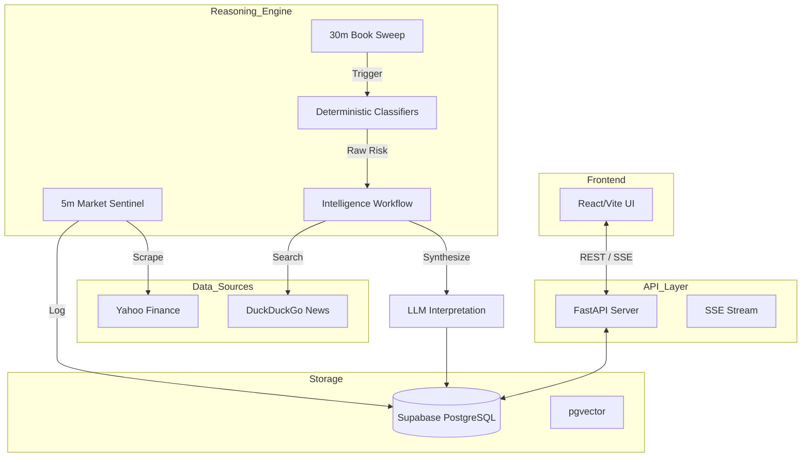

# Technical Requirements Document (TRD) - Atlas Zero

## 1. System Architecture
Atlas Zero is built as a modular system of micro-services. The frontend consumes a unified intelligence feed from the FastAPI backend, which is continuously updated by the reasoning engine.

---

## 2. Technical Stack

| Layer | Technology |
| :--- | :--- |
| **Backend** | Python 3.11, FastAPI, Uvicorn |
| **Database** | Supabase (PostgreSQL), `pgvector` for memory |
| **AI Reasoning** | LangChain, ChatGroq (Llama-3 models) |
| **Scheduling** | APScheduler (In-process) |
| **Data Scraping** | `yfinance`, `duckduckgo-search` |
| **Frontend** | React 18, Vite, Tailwind CSS, Framer Motion |
| **Real-time** | Server-Sent Events (SSE) for stream updates |

---

## 3. Core Intelligence Engines

### 3.1 Market Sentinel (5m Cycle)
- **Purpose**: Detect abnormal UK market volatility.
- **Logic**: Compares current FTSE 100/250 values against the last stored snapshot.
- **Trigger**: If intraday delta > 2%, it triggers an immediate global `Heartbeat` sweep.

### 3.2 Heartbeat Engine (30m Cycle)
- **Purpose**: Strategic client book review.
- **Logic**:
    1. Fetches global market context (Sectors, Indices, Headlines).
    2. Performs a "Vulnerability Assessment" (FCA-aligned) based on client life events.
    3. Runs deterministic classifiers across all client portfolios.
- **Classifiers**:
    - `MarketRisk`: Concentration (>30% in one sector) + Performance sensitivity.
    - `TaxOpportunity`: ISA remaining allowance + Cash balance check.
    - `PensionAllowance`: Tapering detection for high earners (£200k+).
    - `ComplianceExposure`: Drift from target risk score.

---

## 4. Database Schema Highlights

- **`risk_events`**: Append-only log of detected risks. Stores `deterministic_classification` (JSON) and `ai_interpretation` (JSON).
- **`behavioural_memory`**: Client-specific logs with `vector(384)` embeddings for semantic retrieval via `match_memory` RPC.
- **`market_snapshots`**: Time-series data of UK sector performance used for delta analysis.
- **`action_logs`**: Immutable audit trail of every advisor decision (Approve, Reject, Edit).

---

## 5. API Architecture

- **`GET /stream`**: The primary data source for the advisor dashboard. Aggregates risks, meetings, and system logs into a chronological feed.
- **`GET /stream/live`**: SSE endpoint that notifies the frontend of new intelligence events.
- **`GET /live-strip`**: Aggregated market and book-health metrics for the top header.
- **`POST /chat`**: Direct interface to Atlas for ad-hoc book querying.
